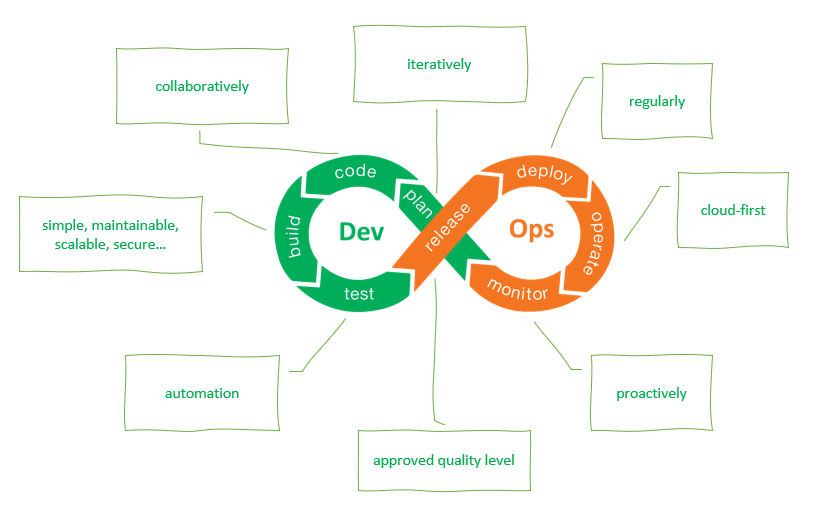
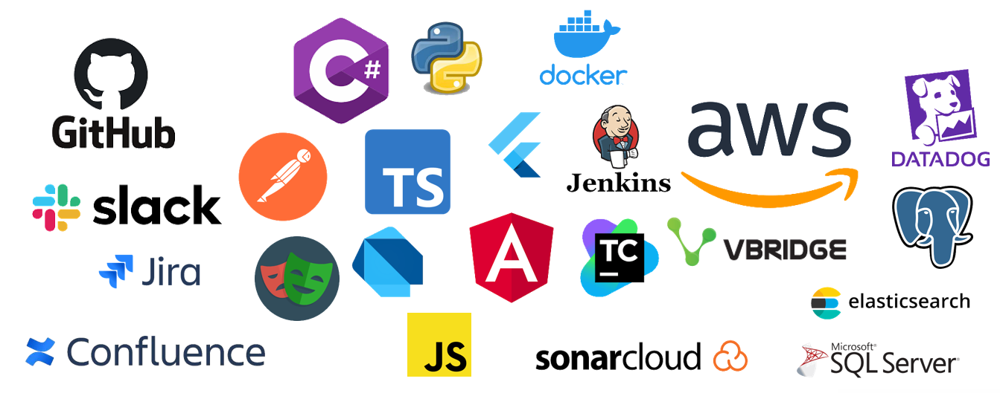

# About us

The Software Development Team helps to enable farmers to make smart decisions on their soil nutrients and the environment via our software tools and other integrated technologies.

## [How we work](how-we-work/README.md)

 
 

## [Technologies and Platforms](technologies/README.md)

 
 

## [Our roles](roles/README.md)

[DevOps Engineer](roles/devops-engineer/README.md)
|
[Software Engineer](roles/software-engineer/README.md)
|
[Test Engineer](roles/test-engineer/README.md)
 
 

## More information
We work on a number of [Solutions](solutions/README.md) for our staff and farmers from a range of locations including our [Head Office](office/README.md).
