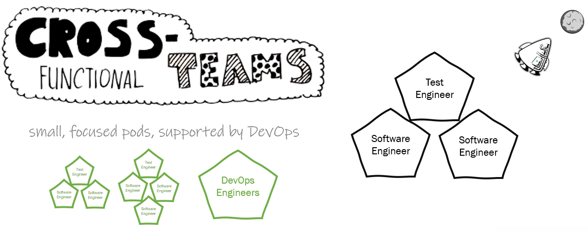

# Our Dev Team Roles

We typically have small pods (teams) of 3-4 people who can focus in on a problem and deliver a solution independently while being supported by DevOps Engineers.

## [DevOps Engineer](devops-engineer/README.md)

## [Software Engineer](software-engineer/README.md)

## [Test Engineer](test-engineer/README.md)

